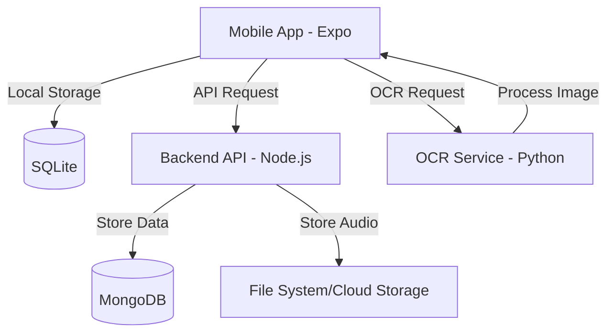

# Offline-First Lead Capture Application

A professional, production-ready React Native application designed for capturing leads during conferences and events. Featuring full offline capability, on-device OCR for business cards, audio note recording, and smart cloud synchronization.

## 🌟 Key Features

- **📶 100% Offline Capable** - Capture leads anytime, anywhere, regardless of internet connectivity.
- **🗄️ SQLite Local Storage** - All data is stored instantly in a local database for maximum reliability.
- **🔍 On-Device OCR** - Extract contact information from business cards using a dedicated Python-based OCR service.
- **🎙️ Audio Notes** - Record and attach voice notes to each lead for better follow-up context.
- **🔄 Smart Cloud Sync** - Automatically synchronizes local data with the cloud when an internet connection is detected.
- **🧠 Deduplication** - Prevents duplicate entries based on phone numbers or email addresses.
- **🎮 Demo Mode** - Integrated tools to simulate network states and seed test data.

---

## 🏗️ Project Architecture



### Component Breakdown
- **Frontend (`/frontend`)**: Built with React Native and Expo. Manages the UI, local state via SQLite, and orchestration of services.
- **Backend (`/backend`)**: A Node.js Express server that handles data persistence in MongoDB and manages audio file uploads.
- **OCR Service (`/backend`)**: A dedicated Python Flask service powered by PaddleOCR for high-accuracy text extraction from images.

---

## 🚀 Getting Started

### 1. Prerequisites
- Node.js (v18+)
- Python 3.8+ (for OCR service)
- MongoDB (Local or Atlas)
- Expo Go (for testing on physical devices)

### 2. OCR Service Setup
```bash
cd backend
./setup_ocr.sh
./start_ocr.sh
```
*The OCR service will run on `http://localhost:5001`.*

### 3. Backend Setup
```bash
cd backend
npm install
cp .env.example .env
# Edit .env with your MONGODB_URI
npm start
```
*The API will run on `http://localhost:3000`.*

### 4. Frontend Setup
```bash
cd frontend
npm install
npx expo start
```
*Press `i` for iOS, `a` for Android, or scan the QR code.*

---

## 🛠️ Technology Stack

| Layer | Technologies |
| :--- | :--- |
| **Frontend** | React Native, Expo, TypeScript, SQLite, Lucide Icons |
| **Backend** | Node.js, Express, MongoDB, Mongoose, Multer |
| **OCR** | Python, PaddleOCR, Flask, PIL |
| **Styling** | NativeWind / Tailwind CSS |

---

## 📁 Repository Structure

- `frontend/`: React Native (Expo) application source code.
  - `app/`: Expo Router screens and layouts.
  - `components/`: Reusable UI elements.
  - `services/`: Business logic (Database, Sync, OCR, Audio).
- `backend/`: Node.js API and Python OCR service.
  - `controllers/`: API route handlers.
  - `models/`: Mongoose schemas.
  - `ocr_service.py`: Python OCR implementation.

---

## 🔌 API Endpoints (Backend)

| Method | Endpoint | Description |
| :--- | :--- | :--- |
| `GET` | `/health` | Check API and DB status |
| `GET` | `/api/leads` | Retrieve all synced leads |
| `POST`| `/api/leads` | Create a new lead in the cloud |
| `POST`| `/api/upload-audio`| Upload audio attachments |

---

## 🧪 Testing and Verification

To test the offline capabilities:
1. Open the app and navigate to the **Sync** tab.
2. Enable **Demo Mode**.
3. Use the **Toggle Network** button to simulate being offline.
4. Capture a new lead; it will be saved to the local SQLite database.
5. Toggle the network back to **Online**; the app will automatically sync the lead to the backend.

---

## 📝 Configuration

### Environment Variables (Backend)
Located in `backend/.env`:
- `PORT`: Server port (default 3000)
- `MONGODB_URI`: Your MongoDB connection string
- `OCR_SERVICE_URL`: URL for the OCR service (default `http://localhost:5001/ocr`)

---

## 📄 License
This project is licensed under the MIT License.

---
Built with ❤️ for rapid, reliable lead capture.